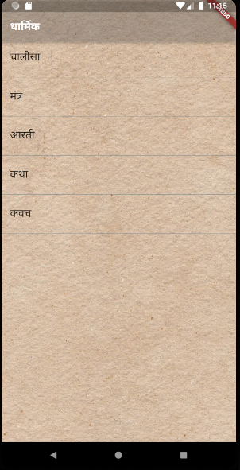
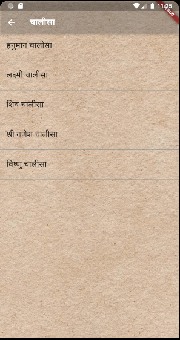
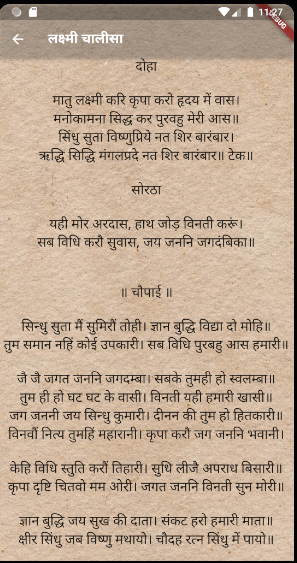

# dharmik

Dharmik will provide you all necessary Aartis, Chalisa, mantras, Katha related to Hindu Dharma. 

## To Download - <a href="https://github.com/ismaan1998/Dharmik/raw/master/app.apk">Click here</a>

<h2> Screenshots -</h2> 

<h2>Demo </h2>-

 

<h2> Contributors </h2> -
<a href="https://www.facebook.com/imankit1998">Ankit Sharma</a>